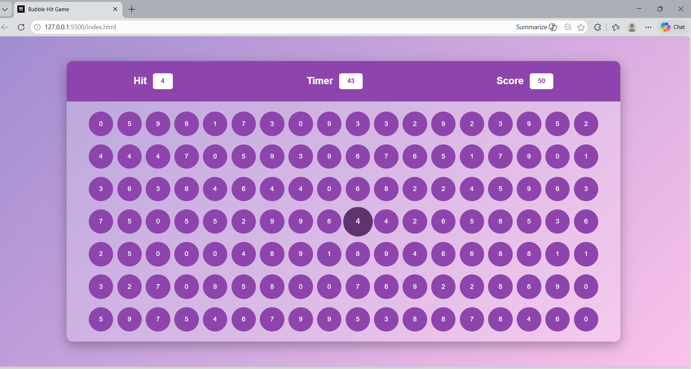

# 🎯 Brain Reflex Game

An interactive browser-based number bubble game built using **HTML, CSS, and JavaScript** that tests players' speed and reflex skills.

## 🚀 Features
- Random target number
- Countdown timer
- Real-time score tracking
- Interactive bubble animations
- Game Over screen with Play Again option
- Responsive design for different screen sizes

---

## 🛠️ Technologies Used
- HTML5
- CSS3
- JavaScript (DOM Manipulation)

---

## 🎮 How to Play
1. Click **Start Game**
2. Match and click the bubble with the displayed **Hit number**
3. Earn points before the timer runs out
4. Try to achieve the highest score!

---

## 📸 Game Preview

## 🌐 Live Demo
https://vrushali-tech.github.io/Brain-Reflex-Game/

---

⭐ Developed by Vrushali Ugale  

📘 Built while learning from Sheriyans Coding School tutorials and further enhanced independently.
